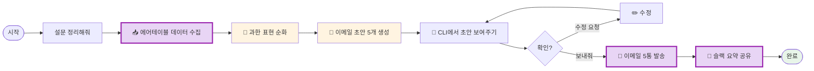

# 나의 워크샵 스킬 설계서

## 0. 선언

- **스킬 이름**: `daily-study-digest`
- **한 줄 설명**: 5개 스터디 무기명 설문을 수집하여 정제 후 스터디장에게 이메일 발송하고, 전체 인사이트를 슬랙에 공유
- **만드는 사람**: 커뮤니티 매니저 / AI 스터디 운영
- **스킬 유형**: [x] 외부 API  [x] 다단계 워크플로우
- **MVP 목표**: "에어테이블 설문 → 과한 표현 순화 → 이메일 초안 확인 → 발송 + 슬랙 공유까지 한 번에"

---

## Core (필수)

### 1. 언제 쓰나요?

**대표 상황**:
매일 아침, 전날 진행된 5개 스터디의 무기명 설문 응답을 확인하고 정리해야 할 때.

**왜 필요한가** (불편/비용/시간):
- 5개 스터디 설문을 일일이 읽고, 과한 표현은 순화하고, 스터디장별로 이메일 작성
- 전체 요약과 인사이트를 정리해서 슬랙에 공유
- 매일 반복되는 작업으로 상당한 시간 소요

### 2. 사용법

**이렇게 부르면**:
- `/daily-study-digest`
- "설문 정리해줘"
- "오늘 스터디 설문 요약해줘"

**결과물 형태**: [x] 메시지  [x] 이메일 발송  [x] 슬랙 공유

**결과물 예시**:
> **이메일 초안 5개** (확인 후 발송)
> + **슬랙 요약 메시지** (전체 인사이트 + 액션 아이템)

### 3. 입력/출력 명세

| 구분 | 내용 |
|------|------|
| **사용자 입력** | 트리거 문장만 (데이터는 에어테이블에서 자동 수집) |
| **필수 옵션** | 없음 (당일 날짜 기준 자동 수집) |
| **선택 옵션** | 특정 날짜 지정 가능 ("어제 설문 정리해줘") |
| **출력 규칙** | 이메일: 격려멘트 + 피드백 + 요약 + raw 데이터 / 슬랙: 전체 요약 + 인사이트 + 액션 |

### 4. 범위

**하는 것** (3개 이내):
1. 에어테이블에서 5개 스터디 설문 데이터 수집 + 과한 표현 순화
2. 스터디장별 이메일 초안 생성 → 확인 후 발송
3. 전체 요약 + 인사이트 + 액션을 슬랙에 공유

**안 하는 것** (2개 이내):
1. 설문 폼 자체를 생성/수정하는 것
2. 스터디장 연락처 관리 (에어테이블에 이미 있다고 가정)

### 5. 데이터/도구/권한

| 항목 | 내용 |
|------|------|
| **읽는 데이터** | 에어테이블 설문 응답 테이블 |
| **쓰는 위치** | Gmail (이메일 발송), Slack (채널 메시지) |
| **외부 서비스** | Airtable, Gmail, Slack |
| **민감정보** | Airtable API Key, Gmail OAuth, Slack Token 필요 |

### 6. 실패/예외 처리

**예상되는 실패 상황**:
1. 오늘 날짜에 해당하는 설문 응답이 없는 경우
2. 특정 스터디장 이메일 주소가 누락된 경우
3. 슬랙 채널 접근 권한 문제

**실패 시 안내 원칙**:
- "오늘자 설문 응답이 없어요. 날짜를 확인하거나 '어제 설문 정리해줘'로 다시 시도해보세요."
- "스터디A 스터디장 이메일이 누락되어 있어요. 에어테이블에서 확인해주세요."

### 7. 대화 시나리오

**정상 케이스**:

**나**: "설문 정리해줘"

**스킬**:
> 5개 스터디 설문 수집 완료! 총 47건의 응답이에요.
>
> ---
> **[스터디A - 김OO 스터디장님]**
> 💬 격려: 이번 주도 고생 많으셨어요!
> 📝 피드백: 시간 조율 이슈 언급이 있었는데, 다음 주 일정 조정 고려해보시겠어요?
> 📊 요약: 대체로 만족 (4.2/5), 과제량 적절
> 📎 raw 데이터 12건 첨부 예정
>
> ---
> **[스터디B - 이OO 스터디장님]**
> 💬 격려: 활발한 토론이 인상적이었어요!
> 📝 피드백: 특별한 이슈 없음
> 📊 요약: 매우 만족 (4.7/5)
> 📎 raw 데이터 8건 첨부 예정
>
> ... (3개 더)
>
> ---
> 확인 후 "보내줘" 라고 하시면 이메일 발송 + 슬랙 공유할게요!

**나**: "보내줘"

**스킬**:
> ✅ 이메일 5통 발송 완료!
> ✅ #스터디-운영 채널에 요약 공유 완료!

**실패 케이스**:

**나**: "설문 정리해줘"

**스킬**:
> 오늘(2/3) 날짜로 등록된 설문 응답이 없어요.
> "어제 설문 정리해줘" 또는 "2/2 설문 정리해줘"로 다시 시도해보세요!

### 8. 테스트 & 완료 기준

**테스트 체크리스트**:
- [ ] 에어테이블에서 오늘 날짜 설문 데이터 정상 수집
- [ ] 과한 표현이 적절히 순화되는지 확인
- [ ] 이메일 초안 5개가 CLI에서 보기 좋게 표시
- [ ] "보내줘" 후 실제 이메일 발송 확인
- [ ] 슬랙 채널에 요약 메시지 정상 전송

**Done 기준**:
"'설문 정리해줘' 한마디로 5개 스터디 설문이 정리되고, 확인 후 이메일+슬랙까지 한 번에 완료되는 상태"

---

## 워크플로 시각화

---

## Optional (스킬 유형에 따라 선택)

### B. 외부 API 연동인 경우

3개의 외부 서비스 연동이 필요합니다.

#### B-1. Airtable

| 항목 | 내용 |
|------|------|
| **연동 방식** | Airtable API (REST) |
| **필요한 credential** | API Key (Personal Access Token) |
| **복잡도** | 쉬움 |
| **예상 설정 시간** | 10-15분 |

**설정 가이드 요약**:
1. Airtable 계정 로그인 → Account → API 섹션
2. "Create new token" 클릭
3. 스코프: `data.records:read` 권한 추가
4. 해당 베이스 접근 권한 부여
5. 토큰 복사 → 환경변수 설정

#### B-2. Gmail

| 항목 | 내용 |
|------|------|
| **Context7 Library ID** | /shinzo-labs/gmail-mcp |
| **필요한 credential** | Google OAuth (Client ID, Client Secret) |
| **복잡도** | 중간 |
| **예상 설정 시간** | 20-30분 |

**설정 가이드 요약**:
1. Google Cloud Console에서 프로젝트 생성
2. Gmail API 활성화
3. OAuth 동의 화면 설정
4. OAuth 2.0 클라이언트 ID 생성 (데스크톱 앱)
5. `client_secret.json` 다운로드
6. MCP 설정 후 인증 플로우 실행

#### B-3. Slack

| 항목 | 내용 |
|------|------|
| **Context7 Library ID** | /korotovsky/slack-mcp-server |
| **필요한 credential** | Slack Token (XOXP 또는 XOXC/XOXD) |
| **복잡도** | 중간 |
| **예상 설정 시간** | 15-20분 |

**설정 가이드 요약**:
1. Slack 워크스페이스 관리자 권한 확인
2. Slack App 생성 또는 기존 앱 사용
3. 필요한 스코프 추가 (channels:write, chat:write)
4. Bot Token 복사
5. MCP 설정에 토큰 추가

---

> **참고**: 상세 가이드는 `연동가이드/` 폴더의 개별 파일을 확인하세요.

### C. 다단계 워크플로우인 경우

**단계 목록** (최대 5단계):
1. **데이터 수집** → 산출물: 5개 스터디 설문 raw 데이터
2. **정제 & 초안 생성** → 산출물: 순화된 데이터 + 이메일 초안 5개
3. **사용자 확인** → 산출물: 승인/수정 피드백
4. **발송** → 산출물: 이메일 5통 + 슬랙 메시지

**중단/재개 방법**:
- 초안 확인 단계에서 언제든 중단 가능
- "아까 그 초안 보여줘"로 재개
- 수정 요청 시 해당 부분만 업데이트

---

## 나중에 더 발전시킬 아이디어

- [ ] 주간 리포트 자동 생성 (일일 데이터 누적 → 주간 트렌드 분석)
- [ ] 특정 키워드 자동 감지 시 알림 (예: "중단", "불만", "환불")
- [ ] 스터디장 응답 템플릿 자동 제안

---

**워크샵 당일 이 설계서 가져오세요!**
