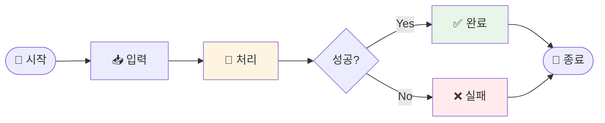

# Design Doc Template

Phase 6에서 사용. 확정된 스킬 아이디어를 아래 템플릿으로 출력.

**템플릿 구성**:
- **Core (필수)**: 모든 스킬에 필요한 핵심 설계
- **Optional (선택)**: 스킬 유형에 따라 필요한 섹션만 활성화

---

```markdown
# 나의 워크샵 스킬 설계서

> 📋 **이 설계서는 [사전설문응답.md](사전설문응답.md) 인터뷰를 바탕으로 작성되었습니다.**

> ⚠️ **이 설계서는 초안입니다!**
> 
> 정답이 아니에요. 워크샵 당일 강사님과 함께 범위를 더 좁히거나, 더 구체화할 수 있습니다.
> 
> **사전과제의 목적**:
> 1. 스킬을 설치해서 한 번 써본 것 ✅
> 2. 나만의 스킬 설계서를 만들어서 "아, 내 작업이 이렇게 자동화되겠구나", "이런 흐름이겠구나" 감 잡기 ✅
> 
> 이 정도면 충분해요! 나머지는 워크샵에서 함께 다듬어봐요 😊

## 목차
- [0. 선언](#0-선언)
- [한눈에 보기](#한눈에-보기) (외부 연동 + 워크플로 시각화)
- [Core (필수)](#core-필수)
  - [1. 언제 쓰나요?](#1-언제-쓰나요)
  - [2. 사용법](#2-사용법)
  - [3. 입력/출력 명세](#3-입력출력-명세)
  - [4. 범위](#4-범위)
  - [5. 데이터/도구/권한](#5-데이터도구권한)
  - [6. 실패/예외 처리](#6-실패예외-처리)
  - [7. 대화 시나리오](#7-대화-시나리오)
  - [8. 테스트 & 완료 기준](#8-테스트--완료-기준)
- [Optional](#optional-스킬-유형에-따라-선택)
  - [A. 파일 기반](#a-파일-기반인-경우)
  - [B. 외부 API 연동](#b-외부-api-연동인-경우)
  - [C. 다단계 워크플로우](#c-다단계-워크플로우인-경우)
- [나중에 더 발전시킬 아이디어](#나중에-더-발전시킬-아이디어)

---

## 0. 선언

- **스킬 이름**: [확정된 이름]
- **한 줄 설명**: [스킬이 하는 일]
- **만드는 사람**: [참석자 이름/직무]
- **스킬 유형**: [ ] 텍스트 변환  [ ] 파일 기반  [ ] 외부 API  [ ] 다단계 워크플로우
- **MVP 목표**: "[이번 워크샵에서 반드시 되는 것 1문장]"

---

## 한눈에 보기

### 외부 연동

| 서비스 | 용도 | 연동 방식 | 복잡도 | 가이드 |
|--------|------|----------|--------|--------|
| [서비스1] | [읽기/쓰기/발송 등] | MCP / 스크립트 / CLI | 쉬움/중간/어려움 | [📘 설정 가이드](연동가이드/서비스1.md) |
| [서비스2] | [용도] | [방식] | [복잡도] | [📘 설정 가이드](연동가이드/서비스2.md) |

> 📁 상세 설정 가이드: [연동가이드/](연동가이드/) 폴더 참조

### 워크플로 시각화

> 💡 **다이어그램이 안 보이나요?**
> 
> VSCode에서 Mermaid 다이어그램을 보려면 확장 프로그램이 필요해요:
> 1. VSCode 왼쪽 사이드바에서 **확장(Extensions)** 아이콘 클릭 (또는 `Cmd+Shift+X`)
> 2. `Markdown Preview Mermaid Support` 검색
> 3. **Install** 클릭
> 4. 이 파일을 다시 열고 **미리보기**(`Cmd+Shift+V`)로 확인!



> **⚠️ 반드시 가로 방향(`flowchart LR`) 사용**
> - 세로(TB)는 길어서 스크롤 필요 → 한눈에 안 들어옴
> - 가로(LR)는 "시작→끝" 흐름이 직관적
>
> **노드 텍스트**: 이모지 + 짧은 키워드 (2-4글자)
>
> **스타일 가이드**:
> - 일반 액션: `fill:#fff4e1` (노란색)
> - 외부 API 호출: `fill:#e8d5f5,stroke:#9c27b0,stroke-width:3px` (보라색 테두리)
> - 성공: `fill:#e8f5e9` (초록색)
> - 오류: `fill:#ffebee` (빨간색)

---

## Core (필수)

### 1. 언제 쓰나요?

**대표 상황**:
[구체적인 사용 상황 - 대화에서 파악한 내용]

**왜 필요한가** (불편/비용/시간):
[현재 얼마나 귀찮은지, 얼마나 자주 하는지]

### 2. 사용법

**이렇게 부르면**:
- `/[스킬명]`
- "[자연어 트리거 1]"
- "[자연어 트리거 2]"

**결과물 형태**: [ ] 메시지  [ ] 파일  [ ] 링크/리포트  [ ] 기타

**결과물 예시**:
> [예상 출력 짧게]

### 3. 입력/출력 명세

| 구분 | 내용 |
|------|------|
| **사용자 입력** | [무엇을 받나? 텍스트/옵션/파일] |
| **필수 옵션** | [반드시 필요한 것] |
| **선택 옵션** | [있으면 좋은 것] |
| **출력 규칙** | [포맷/톤/길이/파일명 등] |

### 4. 범위

**하는 것** (3개 이내):
1. [핵심 기능 1]
2. [핵심 기능 2]
3. [핵심 기능 3]

**안 하는 것** (2개 이내):
1. [스코프 아웃 1]
2. [스코프 아웃 2]

### 5. 데이터/도구/권한

| 항목 | 내용 |
|------|------|
| **읽는 데이터** | [로컬 파일, 폴더, URL 등] |
| **쓰는 위치** | [출력 폴더, 파일명 규칙] |
| **외부 서비스** | [사용 여부 및 서비스명] |
| **민감정보** | [토큰 필요 여부, 개인정보 취급 등] |

### 6. 실패/예외 처리

**예상되는 실패 상황**:
1. [자주 터질 것 같은 상황 1]
2. [자주 터질 것 같은 상황 2]
3. [자주 터질 것 같은 상황 3]

**실패 시 안내 원칙**:
[사용자에게 어떻게 안내할지 - 해결 방법 포함/대체 경로 제시]

### 7. 대화 시나리오

**정상 케이스**:

**나**: "[트리거 문장]"

**스킬**:
> [정상 응답/결과물 예시]

**실패 케이스**:

**나**: "[잘못된 입력 또는 문제 상황]"

**스킬**:
> [친절한 에러 안내 예시]

### 8. 테스트 & 완료 기준

**테스트 체크리스트**:
- [ ] [테스트 1: 기본 케이스]
- [ ] [테스트 2: 다른 입력]
- [ ] [테스트 3: 에러 케이스]

**Done 기준**:
"[누가 봐도 성공이라고 말할 수 있는 상태 1-2줄]"

---

## Optional (스킬 유형에 따라 선택)

### A. 파일 기반인 경우

| 항목 | 내용 |
|------|------|
| **지원 형식** | .md / .csv / .json / ... |
| **예시 입력 파일** | [파일명 또는 내용 일부] |
| **출력 파일 예시** | [파일명 또는 내용 일부] |

### B. 외부 API 연동인 경우

[DETECTED_SERVICES_COUNT]개의 외부 서비스 연동이 필요합니다.

#### 환경변수 요약

이 스킬에 필요한 환경변수 목록입니다. (`.env.example` 참조)

| 변수명 | 서비스 | 발급 방법 |
|--------|--------|----------|
| `[ENV_VAR_1]` | [SERVICE_1_NAME] | [발급 URL 또는 간단 설명] |
| `[ENV_VAR_2]` | [SERVICE_2_NAME] | [발급 URL 또는 간단 설명] |

> **Tip**: Claude Code에게 API 키를 알려주면 자동으로 `.env`에 설정해줘요!
> 예: "슬랙 토큰은 xoxb-xxxx야"

#### B-1. [SERVICE_1_NAME]

| 항목 | 내용 |
|------|------|
| **Context7 Library ID** | [LIBRARY_ID_1] |
| **필요한 credential** | [CRED_TYPE_1] |
| **환경변수** | `[ENV_VAR_1]` |
| **복잡도** | [COMPLEXITY_1] |
| **예상 설정 시간** | [TIME_1] |

**설정 가이드 요약**:
[SETUP_GUIDE_1]

#### B-2. [SERVICE_2_NAME]

| 항목 | 내용 |
|------|------|
| **Context7 Library ID** | [LIBRARY_ID_2] |
| **필요한 credential** | [CRED_TYPE_2] |
| **환경변수** | `[ENV_VAR_2]` |
| **복잡도** | [COMPLEXITY_2] |
| **예상 설정 시간** | [TIME_2] |

**설정 가이드 요약**:
[SETUP_GUIDE_2]

---

> **참고**: 상세 가이드는 `연동가이드/` 폴더의 개별 파일을 확인하세요.

### C. 다단계 워크플로우인 경우

**단계 목록** (최대 5단계):
1. [단계 1] → 산출물: [중간 결과]
2. [단계 2] → 산출물: [중간 결과]
3. [단계 3] → 산출물: [최종 결과]

**중단/재개 방법**:
[중간에 멈추면 어떻게 이어가는지]

---

## 나중에 더 발전시킬 아이디어

- [ ] [고도화 아이디어 1]
- [ ] [고도화 아이디어 2]

---

## 배포 준비 (워크샵 후)

워크샵에서 스킬을 완성한 후, GitHub에 배포하여 다른 사람도 사용할 수 있게 합니다.

### 필요한 파일

| 파일 | 상태 | 설명 |
|------|------|------|
| `SKILL.md` | [ ] 미완성 | 스킬 정의 (워크샵에서 작성) |
| `README.md` | [ ] 자동생성 예정 | 설치 가이드 (배포 시 자동 생성) |
| `.env.example` | [x] 완료 | 환경변수 예시 |
| `.gitignore` | [x] 완료 | .env 제외 설정 |

### 배포 방법

워크샵에서 스킬을 완성한 후, Claude Code에게 말하세요:

```
이 스킬 배포해줘
```

Claude Code가 자동으로:
1. README.md 생성 (설치 방법 + 환경변수 가이드)
2. GitHub 레포 생성
3. 설치 명령어 안내

---

<!-- 
플레이스홀더 설명 (스킬 개발자용):
- [MCP_LIST]: Phase 4.5에서 감지된 서비스 목록 (예: "Gmail, Slack")
- [PREP_REQUIRED]: "워크샵 전 미리 설정 권장" 또는 "당일 설정 가능"
- [SETUP_TIME]: 총 예상 소요 시간 (예: "약 30분")
- [DYNAMIC_SETUP_GUIDE]: Context7로 조사하여 동적 생성
- [ENV_VAR_X]: 환경변수명 (integrations.md 참조)
-->

**워크샵 당일 이 설계서 가져오세요!**
```
